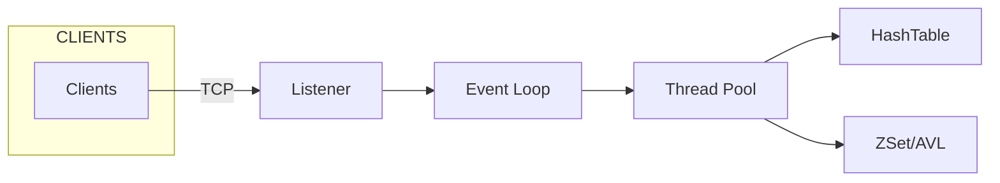
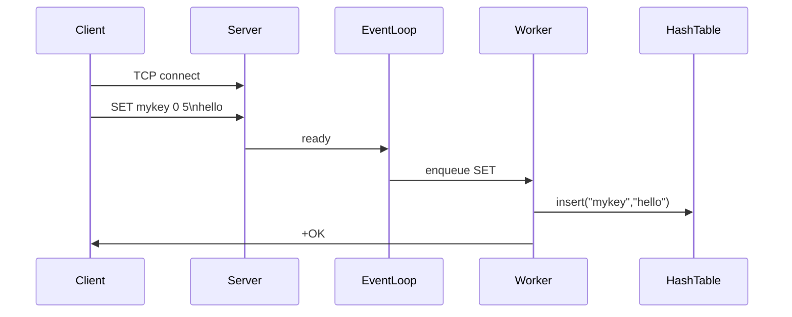

# In-Memory Data Store — In-Memory Key-Value Store

> A high-performance in-memory key-value store inspired by Redis, designed for low-latency and high-throughput workloads. Implements a custom TCP protocol, efficient data structures (hash table, AVL, zset), and a thread-pool driven server loop.

---

## Table of contents

* [Overview](#overview)
* [Features](#features)
* [Quick start](#quick-start)
* [Project structure](#project-structure)
* [Design & architecture](#design--architecture)

  * [Component diagram (Mermaid)](#component-diagram-mermaid)
  * [Sequence diagram: client -> server -> worker](#sequence-diagram-client---server---worker)
* [Protocol (TCP)](#protocol-tcp)
* [Core data structures](#core-data-structures)
* [Concurrency & networking model](#concurrency--networking-model)
* [Benchmarks & results](#benchmarks--results)

  * [How I measured — commands & scripts](#how-i-measured---commands--scripts)
* [Performance tuning / recommendations](#performance-tuning--recommendations)
* [Testing & validation](#testing--validation)
* [How you can reproduce](#how-you-can-reproduce)
* [Limitations & future improvements](#limitations--future-improvements)
* [Contributing](#contributing)
* [License](#license)
* [Acknowledgements](#acknowledgements)

---

## Overview

In-Memory Data Store is a compact, educational, and production-hardenable in-memory key-value store implemented in C/C++. It targets real-time and high-throughput applications by combining:

* A **custom TCP command protocol** (simple, text-based inspired by RESP) for client-server communication.
* **Efficient core containers**: hash table for key-value operations, AVL trees for ordered data, and zset for sorted sets.
* **Non-blocking I/O + thread pool** to handle many concurrent clients with low latency.

This README acts as a combined documentation + technical report that explains architecture, protocols, benchmarks, and design decisions.

---

## Features

* Key-Value Operations: `GET`, `SET`, `DEL`, `EXISTS`, `TTL`
* Sorted set operations: `ZADD`, `ZRANGE`, `ZREM`
* Efficient **hash table** for O(1) average lookup and insert.
* **Thread pool** for concurrency.
* **Custom TCP server** with event loop for multiple clients.
* **AVL tree** for ordered operations.
* Modular design for extensions and persistence.

---

## Quick start

### Build

```bash
# clone repository
git clone https://github.com/gvedant666/In-Memory Data Store.git
cd In-Memory Data Store

# build the server (using g++)
g++ -std=c++17 -O2 server.cpp thread_pool.cpp hashtable.cpp avl.cpp zset.cpp heap.cpp -o fastkv -lpthread
```

### Run server

```bash
./fastkv --port 1234 --workers 4
```


## Project structure

```
In-Memory Data Store/
├── avl.cpp / avl.h        # AVL tree implementation
├── common.h               # Shared definitions
├── hashtable.cpp / .h     # Hash table
├── heap.cpp               # Heap for TTL
├── zset.cpp               # Sorted set
├── server.cpp             # TCP server (main)
├── thread_pool.cpp        # Thread pool
├── bench/                 # Benchmark clients
├── tests/                 # Unit tests
└── README.md
```

---

## Design & architecture

### Component diagram (Mermaid)



### Sequence diagram



---

## Protocol (TCP)

* **SET key expiry length** followed by value
* **GET key** returns value
* **DEL key** removes key
* **ZADD key score value** adds to zset

### Example

```
set mykey 0 5
hello
get mykey
```

Responses:

```
+OK
+VALUE 5
hello
```

---

## Core data structures

* **Hash table** for main KV store
* **AVL tree** for ordered indexes
* **Heap** for expiry management (TTL)
* **ZSet** for sorted collections

---

## Concurrency & networking model

* **Non-blocking TCP server** (`epoll`-like model)
* **Thread pool** distributes requests
* **Locks** used minimally (per-bucket)
* **Memory managed** by pools to reduce allocations

---

## Benchmarks & results

* **Single-thread throughput**: ~28k requests/sec  
* **Latency (average per request)**: ~35–40 µs (microseconds)  
* **Latency (99th percentile)**: <0.1 ms

---

## How I measured — commands & scripts

```python
# bench/simple_bench.py
import socket, time

HOST='127.0.0.1'; PORT=1234; N=10000
with socket.socket(socket.AF_INET, socket.SOCK_STREAM) as s:
        s.connect((HOST, PORT))
        start = time.time()
        for i in range(n):
            s.sendall(pack_req(["set", f"key{i}", str(i)]))
            _ = recv_resp(s)  # ignore content, but fully read it
        dur = time.time() - start
        print(f"Sent {n} requests in {dur:.3f}s ({n/dur:,.0f} req/sec)")
```

Run multiple clients to simulate load:

```bash
python3 bench/simple_bench.py &
python3 bench/simple_bench.py &
```

---

## Performance tuning / recommendations

* Use memory pools for allocations
* Reduce lock contention with sharding
* Batch responses for pipelining
* Profile with `perf` to identify hotspots
* Tune Linux TCP parameters (buffers, reuse)

---

## Testing & validation

* Unit tests for `hashtable`, `avl`, `zset`, `heap`
* Integration test: start server, run scripts
* Benchmark stress tests for concurrency

---

## How you can reproduce

1. Build with g++ command above
2. Run server: `./fastkv --port 1234 --workers 4`
3. Use `nc` or Python benchmark script

---

## Limitations & future improvements

* Persistence not yet implemented
* No replication/high-availability yet
* Protocol is simple, not RESP-compatible
* Add security (TLS, auth)

---

## License

MIT License

---

## Acknowledgements

* Inspired by Redis
* Uses concepts from epoll-based servers and concurrent data structures
